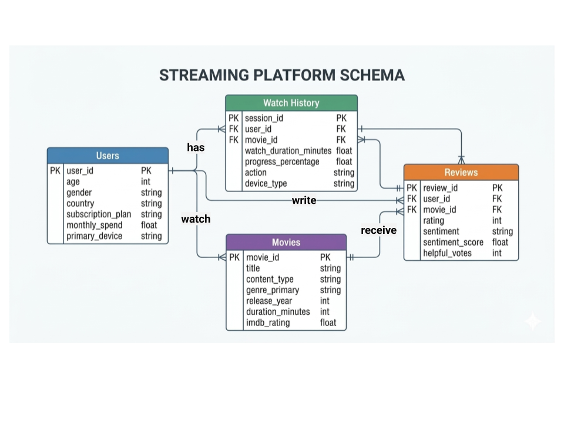

# DS 4320 Project 1: Personalized Content Recommendation

**Ruth Melese (cup6cd)**

---

## Executive Summary

This repository contains the data, cleaning pipeline, and proof-of-concept recommendation system for a personalized content recommendation system built on streaming platform data. The project uses four interrelated datasets — users, watch history, reviews, and movies — to score and rank unwatched titles for a given user based on IMDb ratings, community completion rates, review sentiment, and individual genre affinity. The pipeline demonstrates how structured relational data can be used to generate personalized recommendations that improve content discovery and reduce search time.

---

## Project Information

- **DOI:** [Insert DOI after publishing to Zenodo]
- **Press Release:** [Tired of Searching? A Recommendation System That Finds What You Want Faster](press_release.md)
- **Data:** [OneDrive Folder Link](https://myuva-my.sharepoint.com/:f:/g/personal/cup6cd_virginia_edu/IgAjhQzKwslGR7JxSBBK85FaAeGtPGEIYve6gsApg2Y2YDw?e=zrpke6)
- **Pipeline:** [pipeline/pipeline.ipynb](pipeline/pipeline.ipynb)
- **License:** MIT (see LICENSE)

---

## Problem Definition

### Initial General Problem and Refined Specific Problem Statement

Modern streaming platforms face a broader challenge of helping users navigate extremely large content libraries. As the volume of available media grows, users can become overwhelmed by the number of choices, leading to difficulty in discovering content that matches their interests. This problem extends beyond recommendation systems and includes platform design, search functionality, and content organization.

This project refines that broader challenge into a specific problem: building a recommendation system that predicts which movies or shows a user is most likely to prefer based on prior user-item interactions. Using historical interaction data, the system generates personalized recommendations in the form of ranked content suggestions. The goal is to improve relevance and reduce the time users spend searching for content.

### Rationale for the Refinement

The general problem of content discovery is too broad to address directly because it includes many overlapping factors. Narrowing the problem to personalized recommendations makes it measurable and actionable. User preferences can be inferred from interaction data such as watch history, completion behavior, and ratings. This allows the problem to be framed as a ranking task, where the goal is to order content by predicted relevance.

### Representative User Context

Consider Sarah J., a typical streaming platform user who has watched 15 titles. Her viewing history shows a consistent preference for Horror and Sci-Fi, and she tends to complete most of what she starts. Despite this clear pattern, the platform surfaces largely generic or globally popular recommendations that do not reflect her preferences.

As a result, Sarah spends a disproportionate amount of time searching for content, even though her interests are well-defined in the data. This gap between available behavioral signals and the recommendations produced highlights the need for a system that better translates user interaction data into relevant suggestions.

### Motivation

Recommendation systems shape how users experience digital platforms. Without personalization, users may struggle to find relevant content in large catalogs. Improving recommendation quality can reduce search time and increase engagement. This project explores how structured relational data and user behavior signals can be used to generate more relevant recommendations.

---

## Domain Exposition

### Terminology

| Term | Definition |
|---|---|
| Recommender System | A system that predicts which items a user is likely to prefer and presents them in a ranked order. |
| Personalization | Tailoring content suggestions to an individual user based on their behavior or preferences. |
| Collaborative Filtering | A recommendation method that uses patterns in user-item interactions to suggest items. |
| Content-Based Filtering | A recommendation method that suggests items similar to those a user already liked. |
| User-Item Interaction | Any signal connecting a user to an item, such as a rating, click, watch, or purchase. |
| Ranking | The process of ordering candidate items from most relevant to least relevant. |
| Candidate Generation | The stage where a system narrows a very large catalog to a smaller set of possible recommendations. |
| Matrix Factorization | A collaborative filtering technique that represents users and items as low-dimensional embeddings. |
| Embedding | A learned numerical representation of a user or item in a latent feature space. |
| Relevance Metric | A metric used to evaluate how useful recommendations are, such as precision, recall, or NDCG. |
| Cold Start Problem | The challenge of making recommendations for new users or new items with little to no interaction data. |
| Data Sparsity | A situation where most users have interacted with only a small fraction of available items, making it harder to learn preferences. |
| Latent Factors | Hidden features learned from data that represent underlying patterns in user preferences and item characteristics. |
| Top-N Recommendation | A list of the top N items predicted to be most relevant to a user. |

Source: https://developers.google.com/machine-learning/recommendation/overview/candidate-generation

### Domain Overview

This project falls within the domain of recommender systems, which is a branch of machine learning and information retrieval focused on helping users discover relevant items from large catalogs. Recommendation systems are widely used by streaming services, online stores, and social media platforms to personalize what each user sees. In practice, these systems often rely on collaborative filtering, content-based methods, or hybrid approaches that combine multiple signals. Large-scale platforms also structure recommendations as a pipeline that includes candidate generation, scoring, and ranking. The domain is centered on predicting user preference and presenting results in a way that improves relevance, discovery, and user engagement.

### Background Reading

| Title | Description | Link to file in folder |
|---|---|---|
| Evaluating Recommender Systems | Recommender systems are typically evaluated using ranking and relevance metrics such as precision and recall. These metrics provide a clearer picture of how useful recommendations are beyond simple accuracy. | [evaluating_recommender_systems.pdf](https://myuva-my.sharepoint.com/:b:/g/personal/cup6cd_virginia_edu/IQBBH1fCWuE4RZsqA54qXhsXAXfkSVPzkk9crTc4knY-iz4?e=ecMFK0) |
| Matrix Factorization for Recommendations | Matrix factorization models user-item interactions by mapping both users and items into a shared latent space. This approach allows systems to uncover hidden patterns in preferences and generate personalized recommendations. | [matrix_factorization.pdf](https://myuva-my.sharepoint.com/:b:/g/personal/cup6cd_virginia_edu/IQCD1KEe8c7mQ43zsfVAHgPRAQT69sfRUEIzHXN0wODqENM?e=Lkzvdk) |
| Neural Collaborative Filtering | Neural collaborative filtering extends traditional methods by using neural networks to learn complex user-item relationships. This approach can improve recommendation quality by capturing non-linear patterns in the data. | [neural_collaborative_filtering.pdf](https://myuva-my.sharepoint.com/:b:/g/personal/cup6cd_virginia_edu/IQCgX1dIVenTQ6mqp-ZOmaOuAf0STnvPUvaD3JeYor09gls?e=Ozw1Eu) |
| Limitations of Collaborative Filtering | Collaborative filtering methods often struggle with issues like cold start and sparse data. These limitations can reduce recommendation quality, especially for new users or less popular items. | [collaborative_filtering_limitations.pdf](https://myuva-my.sharepoint.com/:b:/g/personal/cup6cd_virginia_edu/IQBFD0GAQVaeQZUuBXJHqKUTAY_6JKnsuFzmtLW2zJxdl_I?e=6P6TDV) |
| System Architectures for Personalization and Recommendation | Large-scale recommendation systems are typically built as pipelines that include candidate generation, ranking, and filtering stages. These components work together to efficiently deliver personalized content to users. | [recommendation_system_architecture.pdf](https://myuva-my.sharepoint.com/:b:/g/personal/cup6cd_virginia_edu/IQCJ_eIKu7wpTpaHmBU7YmebAUUe4umNSHjE5btBuRdaYJM?e=wHKS2r) |

---

## Data Creation

### Data Acquisition (Provenance)

The dataset used in this project was sourced from a publicly available Kaggle dataset containing user interaction and media metadata. The raw data included user profiles, viewing history, movie attributes, and review information. These datasets were initially stored in separate files with inconsistent formats and varying levels of completeness.

The data was cleaned and transformed into a structured relational format using Python scripts. This process included removing invalid entries, standardizing identifiers, and organizing the data into separate tables representing users, movies, watch history, and reviews.

### Code Used to Create Data

| File | Description | Link |
|------|-------------|------|
| users_clean.py | Cleans and standardizes user-level data, including handling missing values and ensuring consistent user identifiers for downstream joins | https://github.com/ruthmelese/NetflixProject/blob/main/pipeline/users_clean.py |
| watch_history_clean.py | Processes raw viewing session data, deriving completion metrics and structuring user–content interactions for analysis | https://github.com/ruthmelese/NetflixProject/blob/main/pipeline/watch_history_clean.py |
| reviews_clean.py | Cleans review and rating data, normalizing user feedback and preparing sentiment and rating signals for modeling | https://github.com/ruthmelese/NetflixProject/blob/main/pipeline/reviews_clean.py |
| movies_clean.py | Cleans and organizes movie metadata, including genres and external ratings, to support feature engineering and recommendation scoring | https://github.com/ruthmelese/NetflixProject/blob/main/pipeline/movies_clean.py |

### Bias Identification

The dataset is geographically restricted to users in the United States and Canada, meaning the viewing preferences, content ratings, and review sentiment captured here reflect a North American audience only and cannot be generalized to global user behavior. Within those countries, the data only includes users who have active platform accounts, excluding anyone who may watch through shared credentials or who churned before the collection window. Additionally, review and rating data is subject to self-selection bias — users who leave reviews tend to have stronger opinions (positive or negative) than the average viewer, so sentiment distributions may be skewed away from the true center. Finally, the platform's existing recommendation algorithm shapes what content users are exposed to in the first place, meaning watch history reflects algorithmic curation as much as genuine user preference.

### Bias Mitigation

Geographic bias can be partially quantified by segmenting analyses by country and location_country to avoid pooling USA and Canada users when differences exist. Self-selection bias in reviews can be accounted for by weighting analyses by total_votes or restricting to is_verified_watch = True reviews, which at least confirms the reviewer watched the content. Algorithmic exposure bias is harder to remove entirely but can be partially addressed by controlling for subscription_plan and added_to_platform date, since newer or premium content may be surfaced more aggressively by the recommendation engine. Where possible, conclusions should be framed around the behavior of active, account-holding North American users rather than viewers broadly.

### Rationale and Uncertainty

Several judgment calls were made during cleaning that introduce uncertainty and warrant transparency. First, rows with imdb_rating < 1 were dropped on the basis that IMDb's published minimum is 1.0, making sub-1 values likely data entry errors — however, it is possible these represent unrated or newly listed titles and dropping them could slightly undersample newer content. Second, missing age, household_size, and other user fields were dropped rather than imputed, which preserves data integrity but removes roughly 38% of user rows; analyses involving user demographics should account for the possibility that users with complete profiles differ systematically from those without. Third, watch sessions over 600 minutes were retained rather than capped, as they could represent legitimate multi-episode autoplay behavior — but they will inflate mean watch_duration_minutes and should be examined separately in any duration-based analysis. Finally, duplicate user_id + movie_id review combos were kept in full, meaning a small number of users appear more than once per title, which could over-represent highly engaged reviewers in aggregate sentiment scores.

---

## Metadata

### Schema (ER Diagram)

### Data Tables

| Table | Description | Link |
|------|-------------|------|
| Users | User-level information | [users_clean.csv](https://myuva-my.sharepoint.com/:x:/g/personal/cup6cd_virginia_edu/IQA28B07xeZ6S67kSPG6l3oMAfP3mKQrtl0-A8uC-mXjfNo?e=I1CQQb) |
| Movies | Movie metadata | [movies_clean.csv](https://myuva-my.sharepoint.com/:x:/g/personal/cup6cd_virginia_edu/IQDEHxo6M-YwRrY2xktXA8omASj1VLhVXSMnUrnjruEUxj8?e=8OlPay) |
| Watch History | Viewing sessions | [watch_history_clean.csv](https://myuva-my.sharepoint.com/:x:/g/personal/cup6cd_virginia_edu/IQAYhtJwd6agSqN8i7rPL4R5ASvwOE8PtPXNW_KO_maZ5H4?e=vaDYR4) |
| Reviews | User reviews and ratings | [reviews_clean.csv](https://myuva-my.sharepoint.com/:x:/g/personal/cup6cd_virginia_edu/IQDvOiXLZzPtQKbH2ImqqbB5AQa5w4R7Qv-UHQVvj7UhwL4?e=b2WZDJ) |

### Data Dictionary

#### Users

| Feature | Type | Description | Example |
|--------|------|------------|--------|
| user_id | string | Unique user identifier | user_00001 |
| age | integer | User age in years | 43 |
| gender | string | Reported gender | Male |
| country | string | Country of residence | USA |
| subscription_plan | string | Subscription tier | Basic |
| monthly_spend | float | Monthly spend in USD | 36.06 |
| primary_device | string | Most used viewing device | Laptop |

---

#### Watch History

| Feature | Type | Description | Example |
|--------|------|------------|--------|
| session_id | string | Unique session identifier | session_000001 |
| user_id | string | User identifier (foreign key) | user_07271 |
| movie_id | string | Movie identifier (foreign key) | movie_0511 |
| watch_duration_minutes | float | Minutes watched in session | 63.9 |
| progress_percentage | float | Percentage of content completed | 34.6 |
| action | string | Final playback state | completed |
| device_type | string | Device used during session | Tablet |

---

#### Reviews

| Feature | Type | Description | Example |
|--------|------|------------|--------|
| review_id | string | Unique review identifier | review_000001 |
| user_id | string | User identifier (foreign key) | user_07066 |
| movie_id | string | Movie identifier (foreign key) | movie_0360 |
| rating | integer | User rating (1–5) | 4 |
| sentiment | string | Sentiment label | positive |
| sentiment_score | float | Sentiment confidence (0–1) | 0.711 |
| helpful_votes | integer | Number of helpful votes | 3 |

---

#### Movies

| Feature | Type | Description | Example |
|--------|------|------------|--------|
| movie_id | string | Unique movie identifier | movie_0002 |
| title | string | Title of the content | Storm Warrior |
| content_type | string | Type of content | Movie |
| genre_primary | string | Primary genre | Sci-Fi |
| release_year | integer | Year released | 2017 |
| duration_minutes | integer | Runtime in minutes | 37 |
| imdb_rating | float | IMDb rating (1–10) | 3.3 |

### Uncertainty in Numerical Features
#### Reviews

| Feature | Min | Max | Mean | Std Dev | Notes |
|--------|-----|-----|------|---------|------|
| rating | 1 | 5 | 3.66 | 1.11 | Subject to self-selection bias (users with strong opinions more likely to review) |
| helpful_votes | 0 | 13 | 3.00 | 1.73 | Low vote counts may limit reliability |
| total_votes | 0 | 16 | 5.36 | 2.02 | Reviews with 0 votes provide no usefulness signal |
| sentiment_score | 0.0 | 1.0 | 0.64 | 0.25 | Values near 0.5 indicate uncertain sentiment classification |

#### Movies

| Feature | Min | Max | Mean | Std Dev | Notes |
|--------|-----|-----|------|---------|------|
| release_year | 1953 | 2024 | 2006.39 | 11.45 | Older titles may have incomplete metadata |
| duration_minutes | 6 | 586 | 90.51 | 70.80 | Series durations are per episode and not directly comparable to movies |
| imdb_rating | 1.0 | 10.0 | 6.37 | 1.68 | Missing values removed; ratings reflect user-submitted data |
| production_budget | 68,373 | 197,326,642 | 11,037,097 | 24,303,599 | High variance and many missing values (non-movie titles) |
| box_office_revenue | 28,637 | 2,032,055,569 | 61,476,590 | 162,596,158 | Dominated by a small number of high-grossing titles |

Numerical features such as ratings and completion rates contain inherent uncertainty. Ratings are subjective and vary across users, while completion rates may be influenced by external factors unrelated to preference. Missing or sparse data may reduce reliability for less active users or less popular titles.

---

## Press Release

See [press_release.md](press_release.md)

---

## Pipeline

The full pipeline is implemented in:

[pipeline/pipeline.ipynb](pipeline/pipeline.ipynb)

### Case Study: Recommendation for Sarah J.

To evaluate the system, the pipeline is applied to the representative user described earlier. Sarah’s interaction history is used to construct features such as genre affinity, completion behavior, and exposure to highly rated content.

The model scores all unseen titles and ranks them based on predicted relevance. Titles aligned with her preferred genres and strong engagement metrics receive higher scores. Compared to generic recommendations, this approach produces suggestions that better reflect her viewing behavior and reduces the need for extended browsing.

---

## License

MIT — see LICENSE
