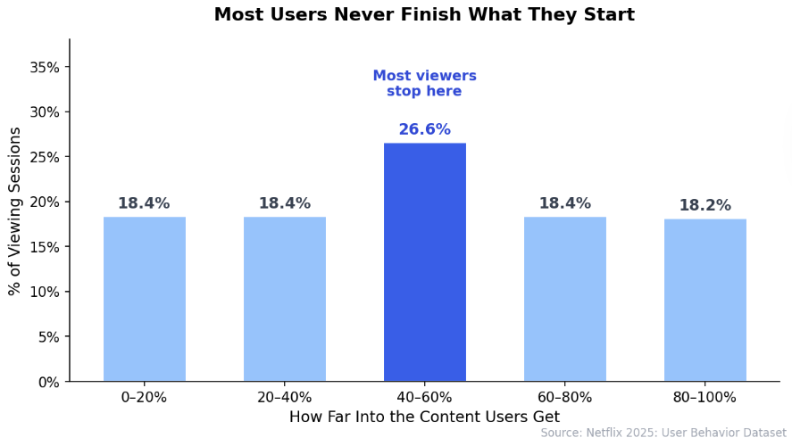

# Tired of Searching? A Recommendation System That Finds What You Want Faster

## The average streaming viewer spends more time scrolling than watching — and most never finish what they start.

---

## The Problem: Too Much Content, Not Enough Direction

Streaming platforms today offer thousands of movies, shows, documentaries, and specials. But more options hasn't meant a better experience. When a platform's library grows faster than its ability to surface the right content, users are left to fend for themselves — scrolling, clicking, abandoning, and starting over.

The data tells the story clearly: across hundreds of thousands of viewing sessions, only **18% of viewers reach the end of what they started**. The rest stop somewhere in the middle — not necessarily because the content was bad, but because they weren't confident it was the right choice when they pressed play. Today's recommendation systems often rely on broad popularity signals or simple genre matching, producing suggestions that feel generic, repetitive, or disconnected from what a specific user actually enjoys.

---

## The Solution: Recommendations Built Around You

This project introduces a personalized recommendation system that learns from real viewing behavior to predict what you'll actually finish — not just what's trending. Instead of recommending the most popular title or the highest-rated movie in a genre, the system analyzes how similar viewers engage with content: how far they get, how they rate it, and what they come back to watch next.

The result is a ranked list of titles tailored to each individual user — surfaced before they start scrolling. If the system predicts you're likely to watch something all the way through, it moves to the top. If a title fits your favourite genre *and* has strong engagement from viewers like you, it gets an extra boost. The goal is simple: spend less time searching, and more time watching something you'll actually enjoy.

---

*This project was completed as part of DS 4320 at the University of Virginia. All data used is either synthetic or anonymized. Full repository available at [https://github.com/ruthmelese/NetflixProject](https://github.com/ruthmelese/NetflixProject).*
